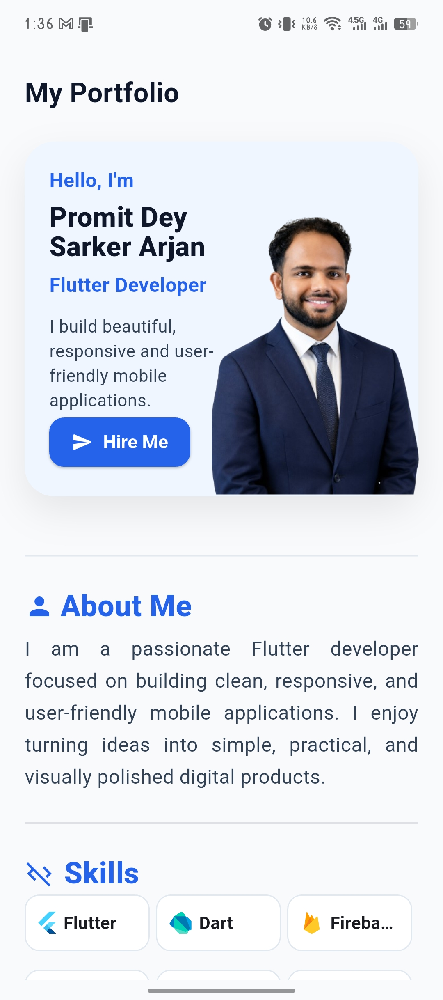
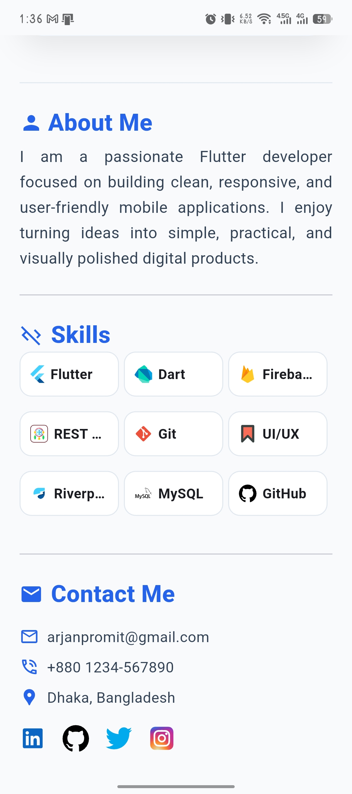
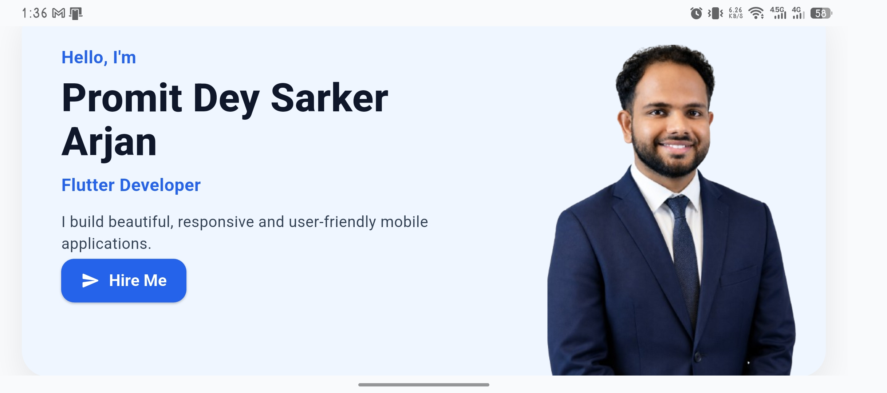
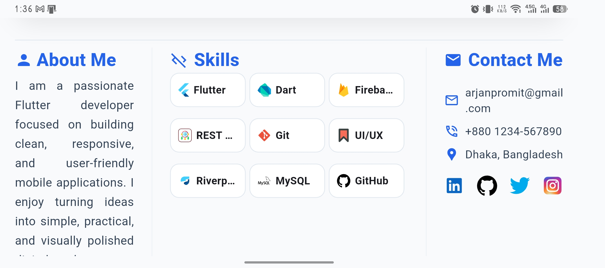
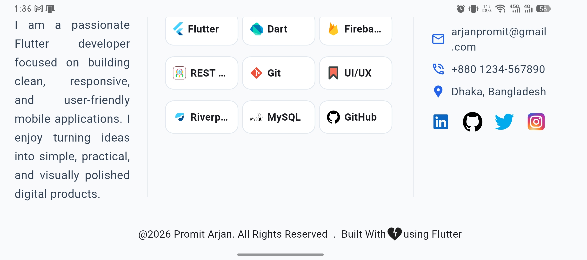

# Personal Portfolio Landing Page

## Project Overview

Personal Portfolio Landing Page is a one-screen Flutter portfolio landing page built as a UI practice project.

The project focuses on responsive design, reusable widgets, clean layout structure, asset management, and support for both portrait and landscape orientations.

## Features

- Responsive hero section
- About section
- Skills section
- Contact section
- SVG icon support
- Image asset usage
- Portrait and landscape layouts
- Reusable widget components
- Clean Flutter UI structure

## Screenshots

<p align="left">
	
	
	
	
	
</p>

## Widgets and Concepts Used

- MaterialApp
- Scaffold
- SafeArea
- SingleChildScrollView
- Column
- Row
- Stack
- Positioned
- Expanded
- Flexible
- Wrap
- Table
- Divider
- Image.asset
- SvgPicture.asset
- Text
- Container
- Padding
- MediaQuery

## Packages Used

- flutter_svg

## Project Structure

```text
lib/
lib/widget/
assets/images/
assets/icons/
lib/screenshot/
```

## Learning Goals

- Responsive Flutter layout
- Portrait and landscape UI handling
- Widget composition
- Reusable component creation
- Asset and SVG management
- Overflow handling
- Clean code organization

## How to Run

```bash
flutter pub get
flutter run
```

## Future Improvements

- Add navigation to contact links
- Improve breakpoints using LayoutBuilder
- Add animations
- Add dark mode
- Improve widget tests

## Author

Promit Dey Sarker Arjan
